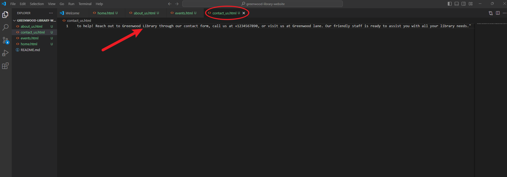
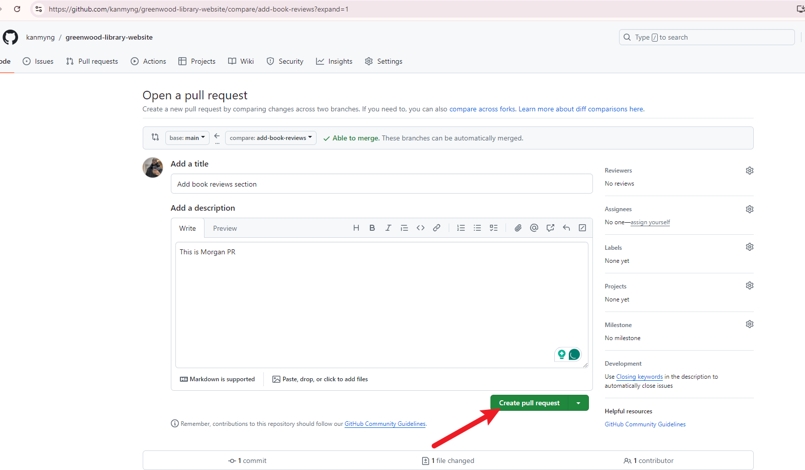

# greenwood-library-website
This project focused on improving the current Greenwood Community Library website by incorporating a "Book Reviews" section and updating the "Events" page to captured forthcoming events. The project emulated a collaborative effort between two developers, Morgan and Jamie, who each played distinct roles in various components of the project.

## Table of Contents
- [Project Overview](#project-overview)
- [Objectives](#objectives)
- [Setup Instructions](#setup-instructions)
- [Branch Workflow](#branch-workflow)
  - [Morgan's Contribution: Adding Book Reviews](#morgans-contribution-adding-book-reviews)
  - [Jamie's Contribution: Updating Events Page](#jamies-contribution-updating-events-page)
- [Screenshots](#screenshots)
- [Final Outcome](#final-outcome)
- [How to Run the Project](#how-to-run-the-project)
- [Contributors](#contributors)

## Project Overview

The Greenwood Community Library website originally featured fundamental sections such as Home, About Us, Events, and Contact Us. The objective of this project was to:

- Add a "Book Reviews" section to the website.
- Update the "Events" page with new community events.

The project replicated the cooperative efforts of two contributors utilizing Git and GitHub to efficiently manage modifications and integrate them.

## Objectives

- Practice cloning a repository and working with branches in Git.
- Gain experience in staging, committing, and pushing changes from multiple developers.
- Create pull requests and merge them after resolving any potential conflicts.

## Setup Instructions

1. **Create a Repository on GitHub:**
   - Repository Name: `greenwood-library-website`
   - Initialized with a `README.md` file.
   

   - Clone the repository to your local machine using:

     Copy the repo http link
    
   ```bash
     git clone https://github.com/kanmyng/greenwood-library-website.git
     ```

    - Open `Git Bash`, navigate to the desire directory created and clone the remote repo to your local system.
    .

    - Navigate to the directory
    

2. **Initial Setup:**
   - On the `main` branch, using Visual Studio editor to create the following files:
     - `home.html`
     - `about_us.html`
     - `events.html`
     - `contact_us.html`

     To open the project in Visual Studio editor, type `code .` in the Git Bash. This will automatically open the project in VS Code editor.
     

     Project opened in VS Code editor
     
    
    - Creation of files in the main branch
    

   - Add some placeholder content to each of these files.

   - `Home.html` content
   

    - `About_us.html` content
   

   - `Event.html` content
   

   - Contact_us.html` content
   

   - Stage, commit, and push these changes to the `main` branch:
     ```bash
     git add .
     git commit -m "Initial setup with basic web pages"
     git push origin main
     ```

    - Staging and committing files, and pushing to main the main branch
   

## Branch Workflow

### Morgan's Contribution: Adding Book Reviews

1. **Create a Branch for Morgan:**
   - Create and switch to a new branch named `add-book-reviews`:

        ```bash
     git checkout -b add-book-reviews
     ```
      

2. **Add Book Reviews Section:**
   - Create a new file `book_reviews.html` for the "Book Reviews" section.
    

   - Add some placeholder text to the file.
    

   - Stage, commit, and push the changes to GitHub:

     ```bash
     git add book_reviews.html
     git commit -m "Add book reviews section"
     git push origin add-book-reviews
     ```

     

3. **Create Pull Request:**
   - On GitHub, create a Pull Request (PR) from the `add-book-reviews` branch to the `main` branch.
   

   - Create PR
   

4. **Merge Morgan's Work:**
   - Review and merge the PR into the `main` branch.
  

### Jamie's Contribution: Updating Events Page

1. **Create a Branch for Jamie:**
   - Create and switch to a new branch named `update-events`:

     ```bash
     git checkout -b update-events
     ```

       

2. **Update Events Page:**
   - Update the `events.html` file with new community events.
      

   - Stage, commit, and push the changes to GitHub:
     ```bash
     git add events.html
     git commit -m "Update events page with new community events"
     git push origin update-events
     ```
     

3. **Pull Latest Changes:**
   - Before raising a PR, pull the latest changes from the `main` branch:

     

    - Create PR
      
      review and merge PR to main branch
      

     ```bash
     git checkout main
     git pull origin main
     git checkout update-events
     git merge main
     ```
    - Switch to main branch, pull origin main. Switch to update-events and merge to main
     

  ## Final Outcome

Following the integration of contributions from both Morgan and Jamie, the Greenwood Community Library website has been enhanced to feature a new "Book Reviews" section, along with an updated "Events" page that showcases the most recent community happenings.

  - Open any of the .html files in a web browser to view the pages.
   